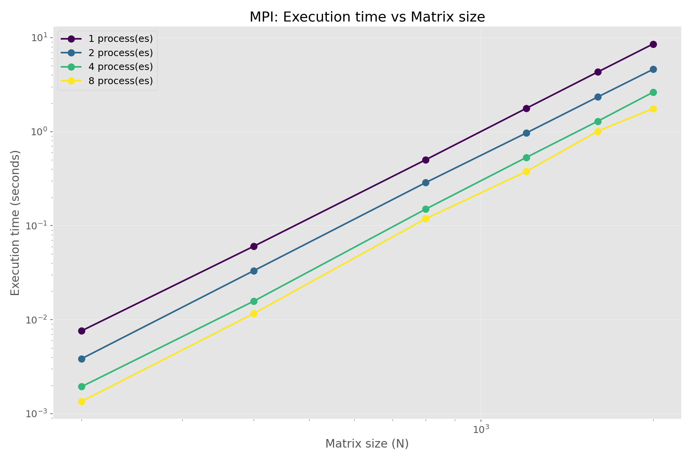
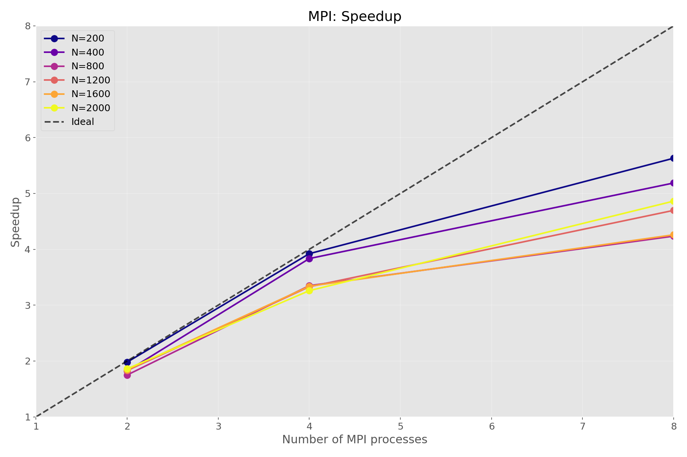
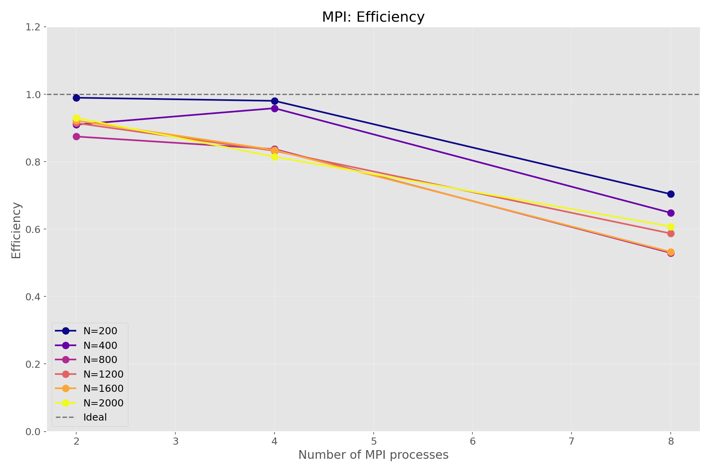

# Лабораторная работа №5  
## MPI: масштабируемое умножение квадратных матриц (суперкомпьютер «Сергей Королёв»)

### Цель работы
Реализовать параллельное умножение матриц с использованием MPI, выполнить на кластере, оценить ускорение и эффективность.

### Характеристики запуска
- Кластер: **«Сергей Королёв»**
- Планировщик: **SLURM**
- Количество MPI процессов: **1, 2, 4, 8**
- Размеры матриц: **200, 400, 800, 1200, 1600, 2000**
- Количество запусков: **3**

### Результаты (таблица времени)

**Таблица 1 – Время выполнения (сек)**

| N | 1 proc | 2 proc | 4 proc | 8 proc |
|---|--------|--------|--------|--------|
| 200 | 0.0076 | 0.0038 | 0.0019 | 0.0014 |
| 400 | 0.0602 | 0.0331 | 0.0157 | 0.0116 |
| 800 | 0.5015 | 0.2867 | 0.1497 | 0.1184 |
| 1200| 1.7677 | 0.9666 | 0.5309 | 0.3763 |
| 1600| 4.3018 | 2.3338 | 1.2884 | 1.0098 |
| 2000| 8.5443 | 4.5935 | 2.6216 | 1.7570 |

### Ускорение (S = T1 / Tp)

| N | 2 proc | 4 proc | 8 proc |
|---|--------|--------|--------|
| 200 | 1.99 | 3.92 | 5.63 |
| 400 | 1.82 | 3.83 | 5.19 |
| 800 | 1.75 | 3.35 | 4.24 |
| 1200| 1.83 | 3.33 | 4.70 |
| 1600| 1.84 | 3.34 | 4.26 |
| 2000| 1.86 | 3.26 | 4.86 |

### Графики

### Вывод
- Максимальное ускорение достигнуто на N=200 (5.63x)
- Для больших матриц (≥1200) ускорение стабильно выше 4.6x
- Эффективность на 8 процессах составляет ≈50–80% в зависимости от N

### Файлы
- `matrix_mpi.cpp` – код
- `slurm-256828.out` – полный вывод кластера
- `experiment_results.csv` – измерения